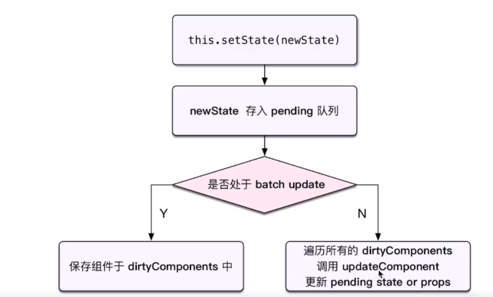

# jsx
# 条件
# 列表渲染
```typescript jsx
render() {
        return <ul>
            { /* vue v-for */
                this.state.list.map(
                    (item, index) => {
                        // 这里的 key 和 Vue 的 key 类似，必填，不能是 index 或 random
                        return <li key={item.id}>
                            index {index}; id {item.id}; title {item.title}
                        </li>
                    }
                )
            }
        </ul>
    }
```
# 事件
## 使用
* bind
```typescript jsx
constructor() {
    // 修改方法的 this 指向
    this.clickHandler1 = this.clickHandler1.bind(this)
}

render() {
  return <p onClick={this.clickHandler1}>
    {this.state.name}
  </p>
}
```
* 静态方法
```typescript jsx
clickHandler2 = () => {
    this.setState({
        name: 'lisi'
    })
}
```

## event
1. event是SyntheticEvent，模拟出来 DOM 事件所有能力
2. event.nativeEvent是原生事件对象
3. 所有的事件，都被挂载到 document 上
4. 和 DOM 事件不一样，和 Vue 事件也不一样

# 组件和props
## 受控组件(表单)-非受控组件
* 优先使用受控组件，符合React设计原则
* 必须操作DOM，必须使用非受控组件

# state和setState
* 不可变值
* 可能是异步更新
* 可能会被合并

# 组件生命周期
## 单个组件
http://projects.wojtekmaj.pl/react-lifecycle-methods-diagram/

##　父子组件
* 和Vue一样

# 函数组件
* 纯函数，只接受props, 输出jsx
* 没有实例，没生命周期，没state
* 不能扩展其他方法

```
function list(props) {
  const { list } = this.props
  return <ul>{list.map((item, index) => {
    return <li key={item.id}>
      <span>{item.title}</span>
    </li>
  })}
  </ul>
}
```
# 非受控组件
* ref
* defaultValue defaultChecked
* 手动操作DOM元素

## 场景
* 手动操作DOM元素, setState实现不了
* 文件上传
```react
<input type=file>
```
* 富文本便捷器


# Portals-传送门
* 组件默认会按照既定的层级嵌套渲染
* 如何让组件渲染到父组件以外

## 场景
* overflow:hidden
* 父组件z-index 太小
* fixed需要放在body第一层级

# Context
* 公共信息（主题，语言）如何传递到每个组件
* 用props 太繁琐
* 用redux 小题大做

# 异步组件
* import() --- vue
* React.lazy
* React.Suspense

# 性能优化
## SCU-shouldComponentUpdate
```react
shouldComponentUpdate(nextProps, nextState) {
  if (nextState.count !== this.state.count) {
    return true //可以渲染
  }
  return false //不可以渲染
}
```
* React 默认返回true：父组件有更新，子组件则无条件也更新
* 配合"不可变值" 一起使用


## PureComponent-React.memo
* PureComponent,scu 中实现了浅比较。class 组件
* memo ---> 函数组件


## 不可变值-immutable.js
* 基于共享数据（不是深拷贝），速度好


# HOC-抽离公共组件
* 使用工厂模式

# Render Props

# Redux
## 概念
* store state
* action
* reducer
## 单向数据流
* dispatch(action)
* reducer -> new State
* subscribe触发更新

## React-redux
* Provider
* connect
* mapStateToProps mapDispatchToProps

## 异步action
* redux-thunk
```react
import { createStore, applyMiddleware } from 'redux';
import thunk from 'redux-thunk';
import rootReducer from './reducers/index';

const store = createStore(rootReducer, applyMiddleware(thunk))
```
* redux-promise
* redux-saga

## 中间件
https://juejin.im/post/5b237569f265da59bf79f3e9


# React-router
* hash
* H5 history


# JSX本质
* 等于VUE模板
* React.createElement （h 函数）， 返回vnode
* 第一个参数，可能是组件，可能是html tag
* 组件名，首字母必须大写

# 合成事件
* SyntheticEvent


## 好处
* 更好的兼容性和跨平台
* 载到document，减少内存消耗，避免频繁解绑
* 方面事件的统一管理（如事务机制）

# setState
## dirtyComponents

* 判断isBatchingUpdates
* 是否命中batchUpdate机制

# batchUpdate
## 哪些能命中batchUpdate机制
* 生命周期（和他的调用函数）
* React中注册的事件（和他的调用函数）
* React可以”管理“的入口
## 哪些不能命中
* setTimeout/setInterval（和他的调用函数）
* 自定义的DOM事件（和他的调用函数）
* React”管不到“的入口


# transaction-事务机制
```react
increase = () => {
  // 开始： 处于batchUpdate
  // isBatchUpdates = true
  
  // 其他操作

  // 结束
  //isBatchUpdates = false
}
```
* 源码
```react
/**
 * <pre>
 *                       wrappers (injected at creation time)
 *                                      +        +
 *                                      |        |
 *                    +-----------------|--------|--------------+
 *                    |                 v        |              |
 *                    |      +---------------+   |              |
 *                    |   +--|    wrapper1   |---|----+         |
 *                    |   |  +---------------+   v    |         |
 *                    |   |          +-------------+  |         |
 *                    |   |     +----|   wrapper2  |--------+   |
 *                    |   |     |    +-------------+  |     |   |
 *                    |   |     |                     |     |   |
 *                    |   v     v                     v     v   | wrapper
 *                    | +---+ +---+   +---------+   +---+ +---+ | invariants
 * perform(anyMethod) | |   | |   |   |         |   |   | |   | | maintained
 * +----------------->|-|---|-|---|-->|anyMethod|---|---|-|---|-|-------->
 *                    | |   | |   |   |         |   |   | |   | |
 *                    | |   | |   |   |         |   |   | |   | |
 *                    | |   | |   |   |         |   |   | |   | |
 *                    | +---+ +---+   +---------+   +---+ +---+ |
 *                    |  initialize                    close    |
 *                    +-----------------------------------------+
 * </pre>
 */
```
# 渲染过程
* props state
* render() 生成vnode
* patch(elem, vnode)

# 更新组件过程
* setState(newState) -> dirtyComponents(可能有子组件)
* render() 生成newVnode
* patch(vnode, newVnode)
# react fiber
## patch被分为2个阶段
* reconciliation阶段 - 执行diff算法，存js计算
* commit阶段 - 将diff结果渲染到DOM

# 不分2阶段可能有问题
* js是单线程，且和DOM渲染共用一个线程
* 当组件足够复杂，组件更新时计算和渲染都压力大
* 在有其他DOM操作需求（动画，鼠标拖拽），将卡顿
## 解决方案fiber
* 将reconciliation阶段进行任务拆分（commit无法拆分）
* DOM需要渲染时暂停，空间时恢复
* window.requestIdleCallback 可以知道需要渲染


