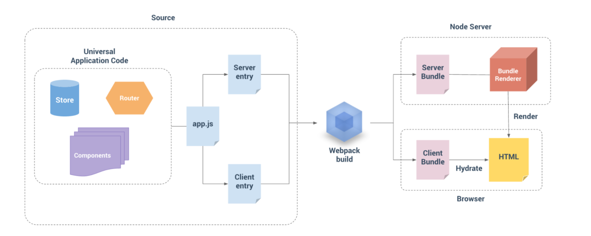

# 导图

## app.js 入口文件
## 两个entry
* client entry的功能很简单，就是挂载我们的Vue实例到指定的dom元素上
* Server entry是一个使用export导出的函数。主要负责调用组件内定义的获取数据的方法，获取到SSR渲染所需数据，并存储到上下文环境中。这个函数会在每一次的渲染中重复的调用。
  
## webpack打包构建
webpack分别打包，生成Server Bundle和Client Bundle
* Server Bundle会运行在服务器上通过node生成预渲染的HTML字符串，发送到我们的客户端以便完成初始化渲染；
* Client Bundle会拿到服务端返回的HTML字符串后，会去“激活”这些静态HTML，是其变成由Vue动态管理的DOM，以便响应后续数据的变化。

# 利弊
## 优点
* 利于SEO
* 利于首屏渲染

## 局限
* 服务器压力大,尤其是高并发访问的情况，会大量占用服务端CPU资源
* 开发条件受限，在服务端渲染中，created和beforeCreate之外的生命周期钩子不可用，因此项目引用的第三方的库也不可用其它生命周期钩子，这对引用库的选择产生了很大的限制；
* 学习成本相对较高
