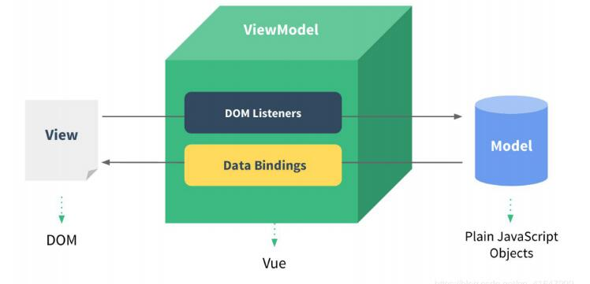
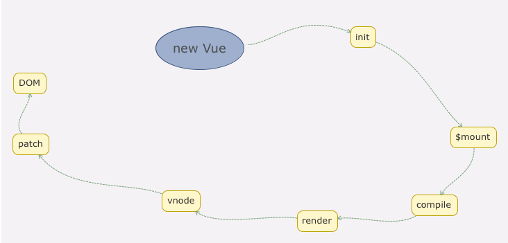
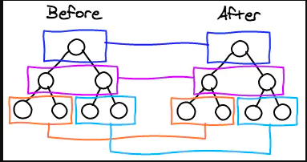
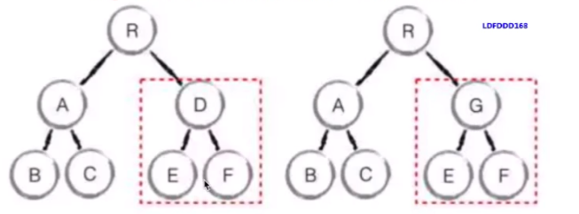

- [MVVM  -- 数据驱动视图](#MVVM--数据驱动视图)
- [new vue(模板和数据如何渲染成最终的 DOM )](#new-vue---------------dom--)
- [Vue的响应式](#vue----)
  * [深度监听](#----)
- [虚拟DOM](#--dom)
  * [VDOM DIFF 算法](#vdom-diff---)
    + [树diff的时间复杂度O（n^3）](#-diff------o-n-3-)
    + [优化时间复杂度O（n）](#-------o-n-)
      - [tag不同，则直接删除重建，不在深度比较](#tag-----------------)
      - [tag 和 key 相同，则认为是相同的节点，不再深度比较](#tag---key--------------------)
      
# MVVM  -- 数据驱动视图


# new vue(模板和数据如何渲染成最终的 DOM )


# Vue的响应式

* defineProperty（只能监听当前的index，在array 和 object）
* Vue 3 使用 proxy（兼容性不好，无法polyfill）


## 深度监听
* 需要一次监听到底，计算量大
* 无法监听新增、删除属性,
* 无法监听数组

# 虚拟DOM
* VUE的虚拟DOM 基于 https://github.com/snabbdom/snabbdom
```vue
//html
<div id="div1" class="class1">
    <p>vdom</p>
    <ul style="font-size: 20px">
        <li>a</li>
    </ul>
</div>

//vdom
{
    tag: 'div',
     props: {
        className:'class1',
        id: 'id1',
     },
    children: [
        {
            tag: 'p',
            clildren: 'vdom'
        },
        {
            tag: 'ul',
            props: {
                style: "font-size: 20px"
            },
            clildren: [
                {
                    tag: 'li',
                    children: 'a'
                }
            ]
        }
    ]
}
```
## VDOM DIFF 算法
### 树diff的时间复杂度O（n^3）
1.遍历树1 2.遍历树2  3.排序 （1000个节点要计算1一亿次， 算法不可用）
### 优化时间复杂度O（n）
####只比较同一层级，不跨级比较

#### tag不同，则直接删除重建，不在深度比较

#### tag 和 key 相同，则认为是相同的节点，不再深度比较

###总结

