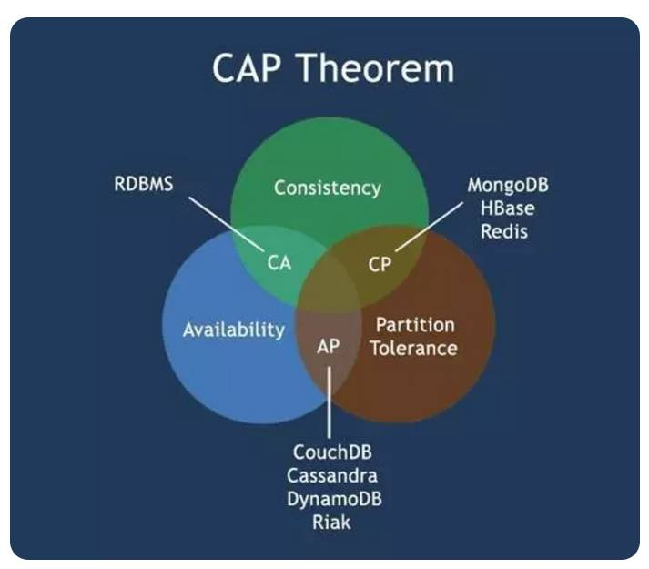
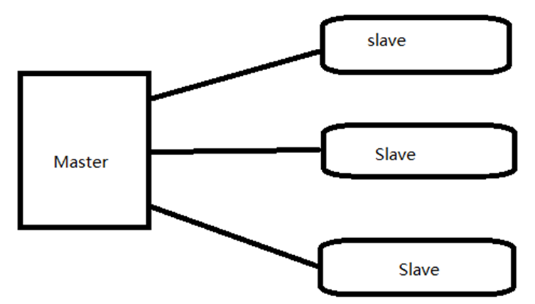
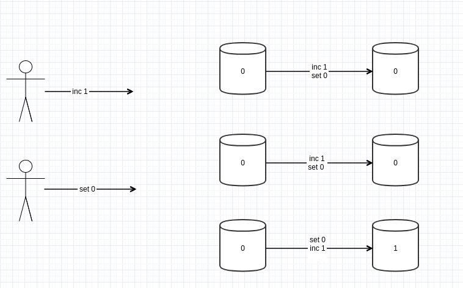
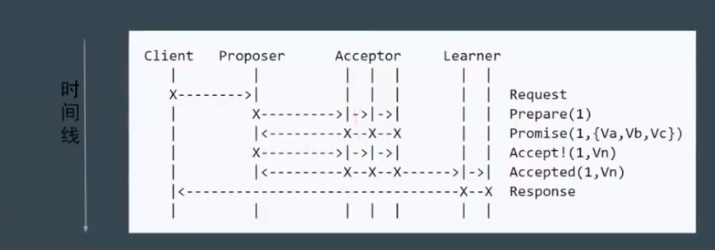
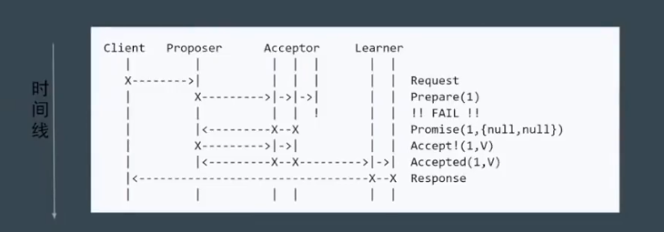
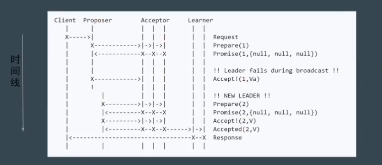
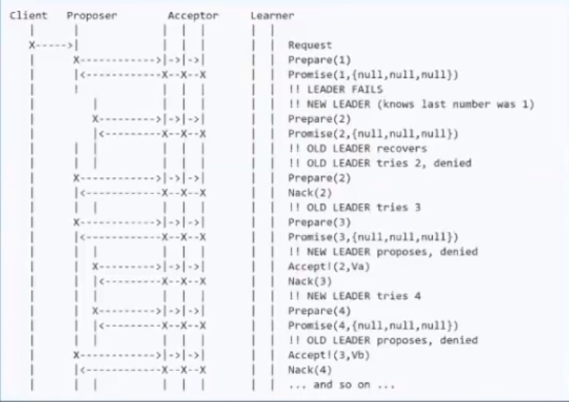
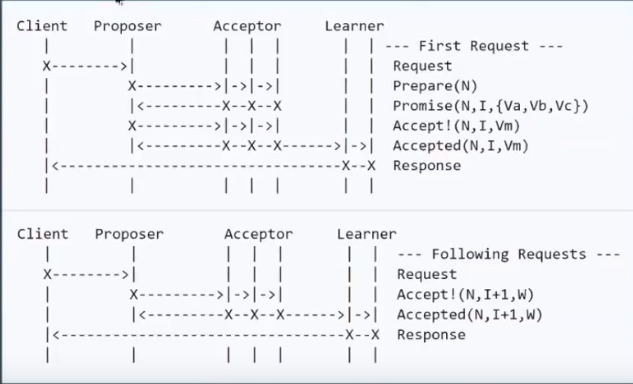
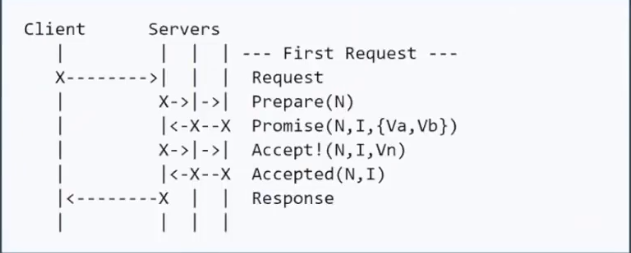

# CAP
CAP原则又称CAP定理，指的是在一个分布式系统中，一致性（Consistency）、可用性（Availability）、分区容错性（Partition tolerance。这三个要素最多只能同时实现两点，不可能三者兼顾。

# 一致性
1. 弱一致性（最终一致性）: DNS， Gossip
2. 强一致性: 同步，Paxos，Raft（muti-paxos）,ZAB（muti-paxos）

# 问题
数据不能存在单点。
分布式系统对fault tolorence的一般解决方案是state machine replication(状态机复制)。
而Paxos就是状态机复制的一种共识算法(consensus)。

# 主从同步
这是一种强一致性算法。
master接受写请求，复制离职到slave，会一直等待到，所有从库返回。

## 问题
当一个节点失败，master就会失败，导致整个集群不可用。一致性保证了，但是可用性大大下降。

# 多数派
这是一种强一致性算法。
每次写都保证写入到大于 N/2个节点，每次读都保证从N/2个节点去读。
## 问题
在并发环境下，无法保证系统的正确性，取决于顺序。

# PAXOS
https://zhuanlan.zhihu.com/p/31780743
这是一种强一致性算法。
Paxos算法是分布式技术大师Lamport提出的。Lamport模拟了一个叫做Paxos的希腊城邦。
一切分布式一致性协议都是 paxos或者他的变种。

有Basic Paxos，Multi Paxos, Fast Paxos
## Basic Paxos
### 角色:
Client: 系统外部角色，类似社会民众，负责提出建议
Propser: 接受client请求，向集群提出提议(propose)。可以表示为[提案编号N，提案内容value]。在冲突发生时，起到冲突调节的作用。
Accpetor: 类似全国人大代表，负责为提案投票，不同意比自己以前接收过的提案编号要小的提案，其他提案都同意。
Learner: 提案接受者（备份），对于集群一致性没影响，负责记录提案。

### 步骤-phases
1. Phase 1a: Prepare
Propser 提出一个提案，编号为N，这个N大于Propser之前提出的提案编号。请求Accpetor的quorum接受。
2. Phase 1b: Promise
如果N大于此Accpetor之前接受的任何提案编号，则接受，不然就拒绝。
3. Phase 2a: Accept
如果达到多数派，Propser会发出accept的请求，此请求包含提案编号N，以及提案内容。
4. Phase 2b: Accepted
如果此Accpetor在此期间没有收到任何编号大于N的提案，就接受提案，不然就忽略。

* 基本流程

* 部分节点失败，但Quoroms

* Proposer 失败

* 潜在的问题，活锁(liveness)或dueling
有2个Proposer分别进行提案。如果提案被打断，重新提出提案。

难实现，效率低（2轮RPC），活锁。

## Multi Paxos
新增角色 - Leader: 唯一的propser， 所有的请求都要进过leader。

进一步简化角色

# Raft
1.划分为3个问题
* Leader Election
* Log Replication
* Safety
2.重新定义角色
* Leader
* Follower
* Candidate
 
 来看动画: http://thesecretlivesofdata.com/raft/
 测试:https://raft.github.io/

# ZAB
* 于raft相同，就是名字不同
如ZAB将某一个leader的周期叫做epoch，raft叫做term。
实现稍微不同：raft心跳方向是leader到follower。ZAB是相反的。
# 应用
* zab -> Zookeeper -> hadoop
* raft -> etcd -> k8s