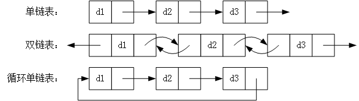
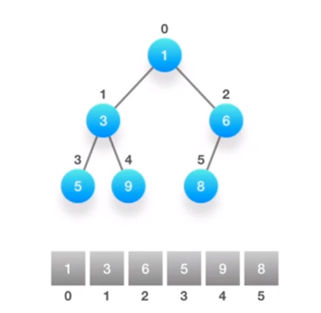
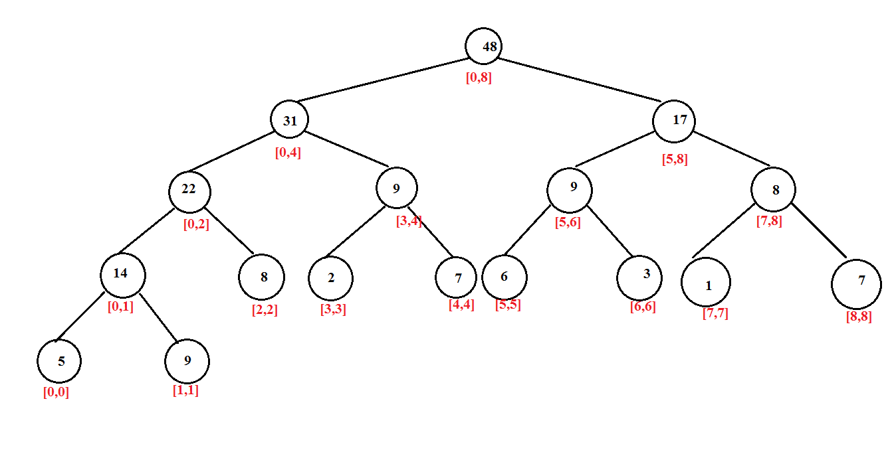

# 常用的数据结构
## 数组,字符串/array,string
### 优点
* 构建一个数组非常简单
* 能让我们在O(1)的时间里根据下标(index)查询某个元素
### 缺点
* 构建他时必须分配一段连续的空间
* 查询某个元素是否存在时需要遍历整个数组，耗费O(n)的时间（n是元素个数）

## 链表/Linked-list
* 单链表 - 链表的每个元素实际上是个对象，而所有对象都通过每个元素中的引用字段，链接在一起。
* 双链表 - 双链表的每个节点中都含有2个引用字段

### 优点
* 灵活分配内存空间
* 能在O(1)时间内删除或添加数据

### 缺点
* 查询元素需要O(n)时间

### 技巧
* 利用快慢指针(有时候3个指针)
* 构建虚假链表头

## 栈/Stack
### 特点
后进先出(LIFO)

### 基本思想
* 可以用一个单链表来实现
* 只关心上一次的操作
* 处理完上一次的操作后，能在O(1)时间内查找到更前一次的操作

## 队列/Queue
### 特点
先进先出(FIFO)

### 基本思想
* 可以用一个双链表来实现
* 按一定的顺序处理数据，且数据不断变化，只处理头尾

## 常用场景
* 广度优先搜索

## 双端队列/Deque
### 基本实现
* 可以用一个双链表来实现
* 队列的头尾二端能在O(1)的时间内对数据查看，添加和删除。

## 常用场景
* 实现一个长度动态变化的窗口或者联系空间

## 树/Tree
### 树的共性
* 结构直观
* 通过树问题来考察 递归算法

### 分类
* 普通二叉树
* 平衡二叉树
* 完全二叉树
* 二叉搜索树
* 四叉树
* 多叉树
* 特殊的树： 红黑树，自平衡二叉搜索树

### 遍历
* 前序遍历(Preoder Traversal) -- root -> left->right
用于树里进行搜索，创建新的树
* 中序遍历(Inoder Traversal) -- left -> root->right
用于二叉搜索树
* 后序遍历(Inoder Traversal) -- left -> right ->root

# 优先队列(Priority Queue)

## 与普通队列区别
* 保证每次取出的数据都是队列中优先级别最高的。
* 优先级可以是自定义
## 常用场景
* 从杂乱无章的数据中按一定的顺序（优先级）筛选数据
## 本质
* 二叉堆的结构（Binary Heap）
* 利用一个数组结构来实现完全二叉树

## 特性
数组中的第一个元素array[0]拥有最高的优先级，给定一个下标i,那么对于元素array[i]而言
* 父节点 - 下标(i-1)/2
* 左侧子节点 - 下标 2i + 2
* 右侧子节点 - 下标2i + 2
数组中每个元素的优先级都必须高于他二测的子节点
## 基本操作
* 向上筛选(sift up/bubble up)
* 向下筛选(sift down/bubble down)

时间复杂度要考虑 - 优先队列的初始化
# 图(Graph)
## 基本知识点
* 阶 度
* 树 森林 环
* 有向图 无向图 完全有向图 完全无向图
* 连通图 连通分量
* 图的存储和表达方式: 邻接矩阵，邻接链表
## 算法
* 图的遍历：深度优先 广度优先
* 环的检测:有向图 无向图
* 拓扑排序
* 最短路径算法:Dijkstra,Bellman-Ford,Floyd Warshall
* 连通性相关算法:Kosaraju,Tarjan, 求解孤岛的数量，判断是否为树
* 图的着色，旅行商问题

# 前缀树(Trie)-字典树
eg:给定一系列构成字典的字符串，要求在字典当中找出所有以"abc"开头的字符串

* 暴力搜索 O(m*n)
* 前缀树 O(m)  m是字典中最长的单词的字符个数
## 重要性质
1. 每个节点至少包含二个基本属性
* children: 数组或者集合，列出每个分支中包含的所有字符
* isEnd: 布尔值，表示该节点是否为字符串的结尾
2. 根节点是空的
3. 除了根节点，其他所有的节点都可能是单词的结尾，叶子节点一定都是单词的结尾
## 基本操作
1. 创建
* 遍历一遍输入的字符串，对每个字符进行遍历
* 从前缀树的根节点开始，将每个字符加到节点的children字符集当中
* 如果字符集已经包含了这个字符，跳过
* 如果当前字符是字符串的最后一个，把当前节点的isEnd标记为true
2. 搜索
* 从前缀树的根节点出发，逐个匹配输入的前缀字符
* 如果遇到就向下一层搜索
* 如果没遇到，立即返回

# 线段树(Segment Tree)
假设我们有一个数组array[0...n-1], 里面有n个元素，现在我们要经常对这个数组做二件事
1. 更新数组元素的值
2. 求数组任意一段区间元素的总和(平均数)
## 方法
1. 遍历数组: 时间复杂度O(n)
1. 线段树: 时间复杂度O(logn)
## 什么是线段树
一种按照二叉树的形式存储数据的结构，每个节点保存的都是数组里某一段的总和

对应的数组是: [5,9,8,2,7,6,3,1,7]

# 树状数组(Fenwick Tree/Binary Indexed Tree)
有一个数组array[0,...,n-1],现在我们要做二件事。
1. 更新数组元素的值
2. 求数组前k个元素的总和(平均值)

## 方法
1. 线段树 O(logn)
2. 树状数组 O(logn)

## 特征
1. 利用数组来表示多叉树的结构，和优先队列类似
2. 优先队列是用数组表示完全二叉树，而树状数组是多叉树
3. 树状数组的第一个元素是空节点
4. 如果节点tree(y)是tree(x)的父节点，那么需要满足y = x - (x & (-x))

# 排序
## 基本排序
1. 冒泡排序（Bubble Sort）
* 比较相邻的元素。如果第一个比第二个大，就交换他们两个。
* 对每一对相邻元素作同样的工作，从开始第一对到结尾的最后一对。这步做完后，最后的元素会是最大的数。
* 针对所有的元素重复以上的步骤，除了最后一个。
* 持续每次对越来越少的元素重复上面的步骤，直到没有任何一对数字需要比较。

2. 插入排序(Insertion Sort)
* 将第一待排序序列第一个元素看做一个有序序列，把第二个元素到最后一个元素当成是未排序序列。
* 从头到尾依次扫描未排序序列，将扫描到的每个元素插入有序序列的适当位置。（如果待插入的元素与有序序列中的某个元素相等，则将待插入元素插入到相等元素的后面。）

## 常用
1. 归并排序(Merge Sort)
* 申请空间，使其大小为两个已经排序序列之和，该空间用来存放合并后的序列
* 设定两个指针，最初位置分别为两个已经排序序列的起始位置
* 比较两个指针所指向的元素，选择相对小的元素放入到合并空间，并移动指针到下一位置
* 重复步骤 3 直到某一指针达到序列尾
* 将另一序列剩下的所有元素直接复制到合并序列尾

2. 快速排序(Quick Sort)
* 从数列中挑出一个元素，称为 “基准”（pivot）
* 重新排序数列，所有元素比基准值小的摆放在基准前面，所有元素比基准值大的摆在基准的后面（相同的数可以到任一边）。在这个分区退出之后，该基准就处于数列的中间位置。这个称为分区（partition）操作
* 递归地（recursive）把小于基准值元素的子数列和大于基准值元素的子数列排序

3. 拓扑排序(Topological Sort)
https://www.jianshu.com/p/3347f54a3187

##　其他排序
1. 堆排序(Heap Sort)
* 创建一个堆 H[0……n-1]
* 把堆首（最大值）和堆尾互换
* 把堆的尺寸缩小 1，并调用 shift_down(0)，目的是把新的数组顶端数据调整到相应位置
* 重复步骤 2，直到堆的尺寸为 1

2. 桶排序(Bucket Sort)
* 设置固定数量的空桶
* 把数据放到对应的桶中
* 对每个不为空的桶中数据进行排序
* 拼接不为空的桶中数据，得到结果

# 递归-Recursion
函数调用本身 -- 自顶向下的算法
## 思想
* 要懂得把一个问题的规模变小
* 再利用从小规模问题中得到的结果
* 结合当前的值或者情况，得出最终的结果

# 回溯
* 从问题本身出发，不断尝试
* 返回一步甚至多步在做选择，直到抵达终点的过程
* 回溯就是用递归实现的

## 步骤
1. 判断当前情况是否违反，如果非法就返回
2. 看当前情况是否满足条件？是的话，就返回当前结果保存起来并返回
3. 在当前情况下，遍历所有可能出现的情况，并进行递归
4.递归完成后，立刻回溯，回溯的方法就是取消上一步的尝试

# 深度优先搜索算法-DFS
1. DFS解决的是连通性的问题，即给定二个点，起始点和终点，判断是否有一条路径能从起点连接到终点。
2. 很多情况下，连通的路径有很多条，只需要找出其中的一条即可，DFS只关心路径存在与否，不在乎长短。

## 思想
1. 从起点出发，选择一个可选方向不断向前，直到无法继续为止
2. 然后尝试另外一种方向，直到最后走到终点。
3. 需要使用栈

# 广度优先搜索-BFS
BFS用来解决最短路径的问题
1. 从起点出发，一层一层的进行
2. 每层当中的点距离起点的步数是相同的
## 双端BFS
同时从起点和终点开始进行的

# 思想
1. BFS需要借助队列（Queue）- 先进先出

# 动态规划
## 定义
是一种数学优化的方法，也是编程的方法
## 重要属性
* 最优子结构Optimal Substructure - 状态转移方程f(n)
* 重叠子问题Overlapping Sub-problems

